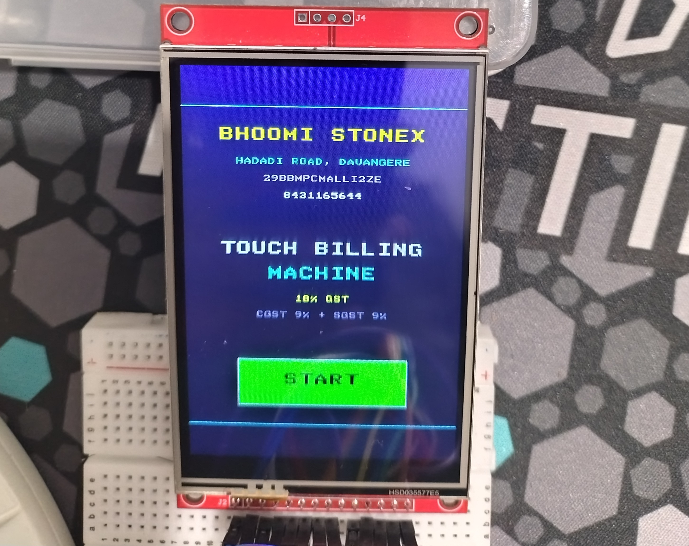
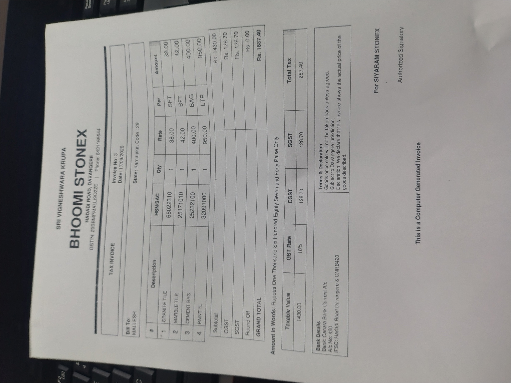

# 🧾 STM32 Touchscreen Billing Machine

A real-time embedded billing system developed using the **STM32F103C8T6** microcontroller with an **ILI9488 TFT touchscreen display**.

The system provides a touch-based user interface for product selection, quantity entry and bill calculation. A **Python-based PC application** is used to format and print the final bill.

---

## 📌 Project Overview

The STM32 Touchscreen Billing Machine is an embedded billing solution designed using the STM32F103C8T6 microcontroller.

The system combines an STM32-based touchscreen interface with a Python-based PC printing application.

The user can interact with the billing system through the TFT touchscreen, select products, enter quantities and calculate the total amount. The billing information is then transferred to the PC, where a Python application formats the bill and sends it to the printer.

### Basic Workflow

```text
User
 │
 ▼
STM32F103C8T6
 │
 ▼
ILI9488 TFT Touchscreen
 │
 ▼
Product Selection
 │
 ▼
Quantity Entry
 │
 ▼
Bill Calculation
 │
 ▼
PC / Python Application
 │
 ▼
Bill Formatting
 │
 ▼
Printer
 │
 ▼
Printed Bill
🎯 Project Objectives
Develop a real-time embedded billing system.
Use STM32F103C8T6 for embedded firmware development.
Interface an ILI9488 TFT display using SPI.
Implement touchscreen-based user interaction.
Develop a touch-based graphical user interface.
Implement product selection and quantity handling.
Calculate the total billing amount.
Communicate billing information to a PC.
Develop a Python application for bill generation and printing.
Generate a formatted physical bill.
⚙️ Main Features
🖥️ Touchscreen Interface
ILI9488 TFT display
Touch-based user interaction
Touch-coordinate detection
Touch-based navigation
Product selection
Quantity entry
Billing information display
🧾 Billing System
Product selection
Quantity handling
Item-wise calculation
Total amount calculation
Bill generation
Final invoice preparation
🖨️ Python Printing Application
Receives billing information from the embedded system
Processes billing data
Formats the bill
Generates the printable invoice
Sends the formatted bill to the printer
🔩 Hardware Components
Component	Purpose
STM32F103C8T6	Main microcontroller
ILI9488 TFT Display	User interface
TFT Touchscreen	User input and navigation
PC	Bill processing and printing
Printer	Physical bill output
💻 Software & Development Tools
Embedded C
STM32CubeIDE
STM32 HAL
ST-Link
Python
Git
GitHub
Proteus for testing/simulation where applicable
🔌 Communication & Interfaces
SPI – TFT Display

The ILI9488 TFT display is interfaced with the STM32F103C8T6 using the SPI communication protocol.

STM32F103C8T6
       │
       │ SPI
       ▼
ILI9488 TFT Display

Main SPI signals:

MOSI  → Display Data
MISO  → Display Data
SCK   → SPI Clock
CS    → Chip Select
DC    → Data / Command
RESET → Display Reset
Touchscreen

The touchscreen is integrated with the TFT display and is used for:

Touch detection
Coordinate reading
Button selection
Screen navigation
Product selection
Billing interaction
🏗️ System Architecture
                  ┌───────────────────────┐
                  │    STM32F103C8T6      │
                  │     Microcontroller   │
                  └───────────┬───────────┘
                              │
                              │ SPI
                              ▼
                  ┌───────────────────────┐
                  │   ILI9488 TFT        │
                  │   Touchscreen Display │
                  └───────────┬───────────┘
                              │
                              ▼
                     ┌────────────────┐
                     │ User Interaction│
                     └───────┬────────┘
                             │
                             ▼
                    ┌─────────────────┐
                    │ Product / Qty   │
                    │ Selection       │
                    └────────┬────────┘
                             │
                             ▼
                    ┌─────────────────┐
                    │ Billing Logic   │
                    │ & Calculation   │
                    └────────┬────────┘
                             │
                             ▼
                    ┌─────────────────┐
                    │ PC / Python App │
                    └────────┬────────┘
                             │
                             ▼
                    ┌─────────────────┐
                    │ Bill Formatting │
                    └────────┬────────┘
                             │
                             ▼
                    ┌─────────────────┐
                    │     Printer     │
                    └─────────────────┘
🔄 System Working
START
  │
  ▼
Initialize STM32
  │
  ▼
Initialize TFT Display
  │
  ▼
Initialize Touchscreen
  │
  ▼
Display Billing Interface
  │
  ▼
User Selects Product
  │
  ▼
User Enters Quantity
  │
  ▼
Calculate Item Amount
  │
  ▼
Calculate Total Amount
  │
  ▼
Prepare Billing Data
  │
  ▼
Send Data to PC
  │
  ▼
Python Application Processes Data
  │
  ▼
Format Bill
  │
  ▼
Print Bill
  │
  ▼
END
📸 Project Output
🖥️ TFT Touchscreen Display

The ILI9488 TFT touchscreen provides the user interface for product selection, quantity entry and billing operations.

🧾 Printed Bill

The Python-based printing application formats the billing information and generates the final physical bill.

🧑‍💻 My Contribution
Developed STM32F103C8T6 firmware using Embedded C.
Implemented the ILI9488 TFT display interface using SPI communication.
Integrated the TFT touchscreen for user interaction.
Implemented touch-coordinate detection and touch-based navigation.
Designed the touch-based GUI for product selection and billing.
Implemented product selection, quantity handling and total billing logic.
Developed the communication interface between the embedded system and PC.
Developed a Python-based billing and printing application.
Implemented bill formatting and generated the final printed invoice using Python.
Integrated the STM32 billing system with the PC-based printing workflow.
Performed hardware testing and debugging using STM32CubeIDE and ST-Link.
Used Git and GitHub for source-code management and project version control.
🧠 Embedded Concepts Demonstrated

This project demonstrates practical knowledge of:

STM32 microcontroller programming
Embedded C
GPIO
SPI communication
TFT display interfacing
Touchscreen interfacing
Touch-coordinate processing
GUI development
User input handling
Data processing
Billing calculations
Embedded-to-PC communication
Python application development
Printer integration
Hardware debugging
Firmware development
🛠️ Development Process

The project was developed through the following stages:

STM32F103C8T6 microcontroller configuration
GPIO configuration
SPI peripheral configuration
ILI9488 TFT driver integration
TFT display initialization
Touchscreen integration
Touch-coordinate handling
Touch-based GUI development
Product selection implementation
Quantity handling implementation
Billing calculation implementation
Embedded-to-PC communication
Python billing application development
Bill formatting implementation
Printer integration
Hardware testing
Debugging using STM32CubeIDE and ST-Link
Final system integration
🐛 Testing & Debugging

The system was tested during hardware development and integration.

Testing included:

TFT display initialization
SPI communication
Touchscreen response
Touch-coordinate accuracy
Touch button functionality
Product selection
Quantity entry
Billing calculations
Data communication with PC
Python bill generation
Printed bill output
Complete system integration
📂 Project Structure
pcmachine/
│
├── Core/
│   ├── Inc/
│   └── Src/
│
├── Drivers/
│
├── Debug/
│
├── .settings/
│
├── pcmachine.ioc
├── STM32F103C8TX_FLASH.ld
├── pcmachine Debug.launch
├── .project
├── .cproject
├── display-working.jpg
├── printed-bill.jpg
└── README.md
📚 Technologies Used
Microcontroller:
    STM32F103C8T6

Programming Language:
    Embedded C

Display:
    ILI9488 TFT

User Input:
    TFT Touchscreen

Communication:
    SPI

PC Application:
    Python

Development IDE:
    STM32CubeIDE

Programming / Debugging:
    ST-Link

Version Control:
    Git
    GitHub
📈 Future Improvements

Possible future enhancements include:

Product database management
Product stock management
Automatic invoice numbering
RTC-based date and time
SD card billing history
Barcode scanner integration
Customer information management
Multiple user/admin modes
Improved graphical user interface
Wireless communication
Cloud-based billing data management
🎓 Key Learning Outcomes

Through this project, I gained practical experience in:

STM32F103C8T6 firmware development
Embedded C programming
SPI communication
TFT display interfacing
Touchscreen interfacing
Touch-coordinate processing
Embedded GUI development
Real-time user interaction
Billing algorithm implementation
PC and embedded-system integration
Python application development
Printer integration
Hardware debugging
Git and GitHub version control
🚀 Project Highlights
Microcontroller     → STM32F103C8T6
Display             → ILI9488 TFT
User Input          → Touchscreen
Display Interface   → SPI
Firmware            → Embedded C
PC Application      → Python
Output              → Printed Bill
Development IDE     → STM32CubeIDE
Debugging           → ST-Link
Version Control     → Git / GitHub
👨‍💻 Author
Mallesh S D

Embedded Systems Engineer

Technical Interests
Embedded Systems
Embedded C
STM32 Microcontrollers
Firmware Development
ARM Microcontrollers
SPI Communication
TFT & Touchscreen Interfaces
Python
Hardware Interfacing
Electronics & IoT
⭐ Repository

This repository contains the source code and project files for the STM32 Touchscreen Billing Machine.
GitHub:
https://github.com/MalleshSD/pcmachine
## 📸 Project Output

### 🖥️ TFT Touchscreen Display

The ILI9488 TFT touchscreen provides the user interface for product selection, quantity entry and billing operations.



### 🧾 Printed Bill

The Python-based printing application formats the billing information and generates the final physical bill.


